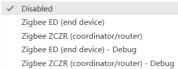

# How use NM-CYD-C5 with Arduino

## 1. Add ESP32 Board Support
1. Go to `File`->`Preferences`

2. Add to "Additional Boards Manager URLs":

   ```
   https://espressif.github.io/arduino-esp32/package_esp32_index.json
   ```

3. Go to `Tools`->`Board`->`Boards Manager`

4. Search "ESP32" and install "ESP32 by Espressif Systems", the version 3.3.5 or a higher version can support ESP32-C5.

5. Then choose `ESP32C5 Dev Module` from `Tools`->`Board`->`esp32`->`ESP32C5 Dev Module`.

## 2. Install the libraries

Arduino IDE Libray Manger, Install the libraries below:

 - `TFT_eSPI` by Bodmer
 - `XPT2046_Touchscreen` by Paul Stoffregen

## 3. The `libraries\TFT_eSPI\User_Setup.h` change to NM-CYD-C5

```c
#define ST7789_DRIVER

#define TFT_BL   25            // LED back-light control pin
#define TFT_BACKLIGHT_ON HIGH  // Level to turn ON back-light (HIGH or LOW)

#define TFT_MISO  2
#define TFT_MOSI  7
#define TFT_SCLK  6
#define TFT_CS    23  // Chip select control pin
#define TFT_DC    24  // Data Command control pin
#define TFT_RST  -1  // Set TFT_RST to -1 if display RESET is connected to ESP32 board RST

// share SPI with TFT
#define TOUCH_CS 1     // Chip select pin (T_CS) of touch screen

#define SPI_FREQUENCY  20000000
// Optional reduced SPI frequency for reading TFT
#define SPI_READ_FREQUENCY  20000000
// The XPT2046 requires a lower SPI clock rate of 2.5MHz so we define that here:
#define SPI_TOUCH_FREQUENCY  2500000
```

# To develop ZigBee with NM-CYD-C5

1. Choose ZigBee mode: `Tools`->`ZigBee Mode`, choose the mode you want, `Zigbee ED(End Device)`, will set ESP32-C5 as a ZigBee End Device.



2. Choose Partition Scheme: `Tools`->`Partition Scheme` to `Zigbee 8MB with spiffs`.

## Zigbee Overview

Zigbee is a low-power, low-bandwidth wireless communication protocol based on the IEEE 802.15.4 stardard. It is used for IoT scenarios such as home automation, smart cities, and industrial control, offering robust mesh networking capabilities for reliable communication in dynamic environments.

Zigbee communication relies on the Zigbee Cluster Library (ZCL), which defines how devices organize their functionality and interact.

## Zigbee Network Architecture

 - Zigbee Coordinator (ZC)
 - Zigbee Router (ZR)
 - Zigbee End Device (ZED)

Espressif examples of Zigbee can get from github: [Arduino-esp32 Zigbee Examples](https://github.com/espressif/arduino-esp32/tree/master/libraries/Zigbee/examples)