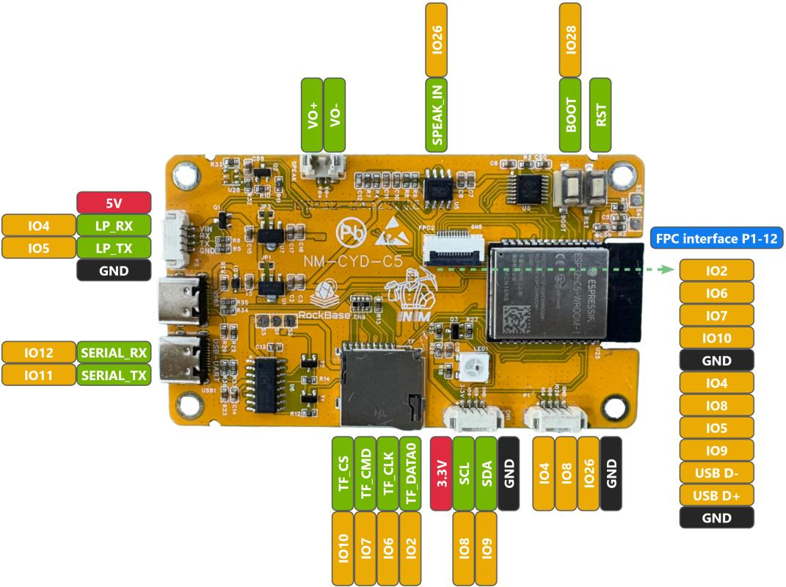
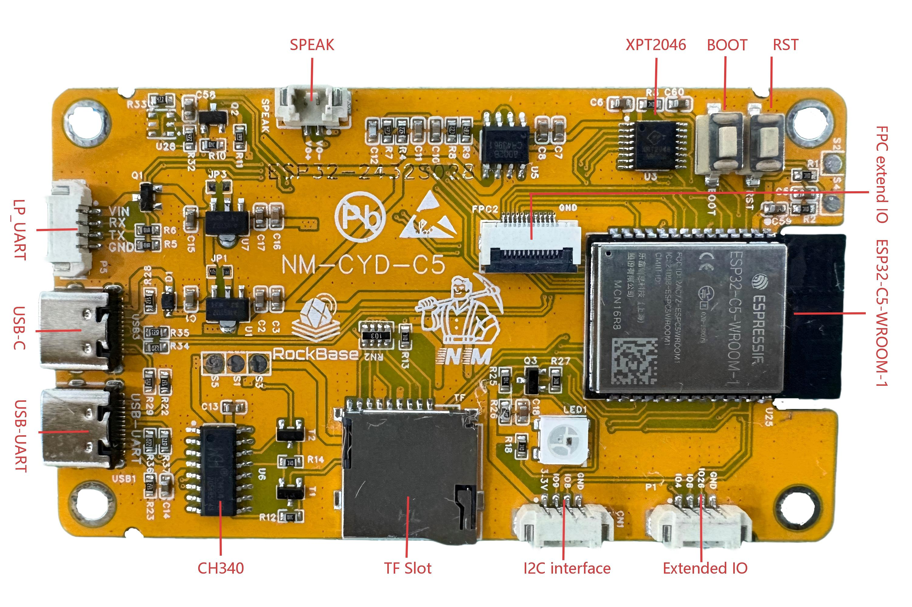
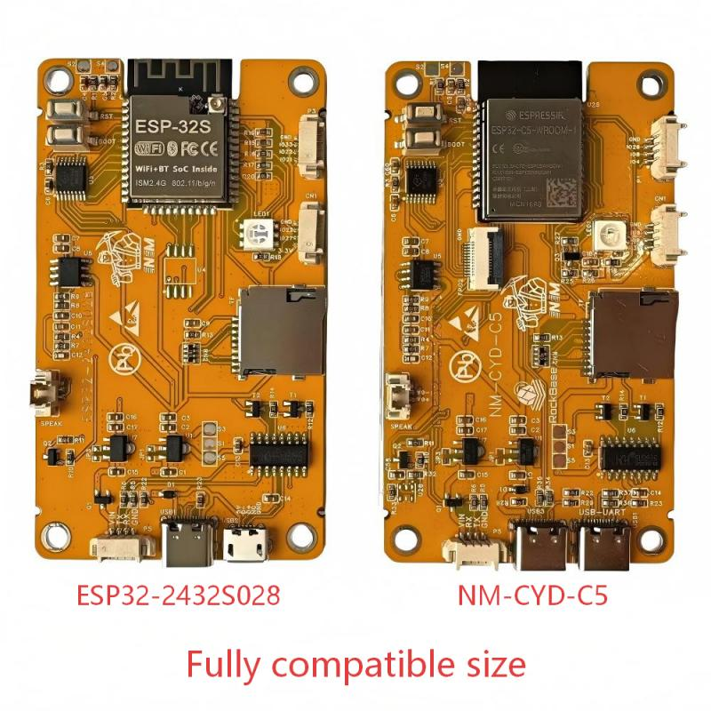
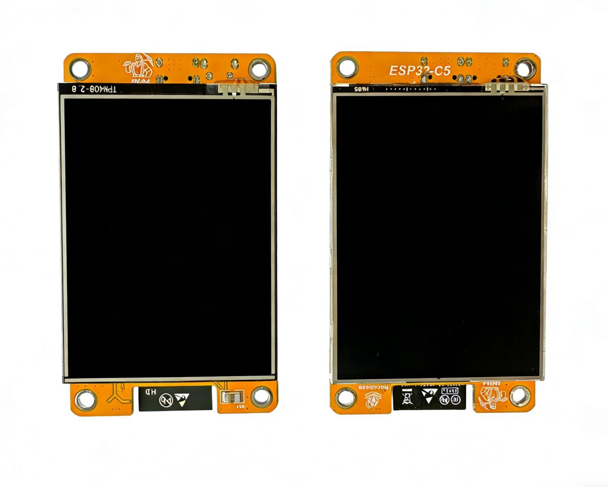

# NM-CYD-C5
Cheap Yellow Display with ESP32-C5, support dual-band Wi-Fi 6 / BLE 5 / Thread /Zigbee.
There is an ESP32 with a built in 320 x 240 2.8" LCD display with a touch screen like the [ESP32-Cheap-Yellow-Display](https://github.com/witnessmenow/ESP32-Cheap-Yellow-Display), the default LCD display driver is ST7789, also can change to ILI9341 driver.

# Features
The NM-CYD-C5 has the following features:
 - ESP32-C5-WROOM-1, 16MB Flash and 8MB PSRAM
 - 320 x 240 LCD Display ( 2.8")
 - Touch Screen
 - ESP32-C5 USB Type-C port and USB Type-C to UART Port (CH340), for powering and programming
 - SD Card Slot, RGB LED and some additional pins
 - Fully compatible dimensions and interfaces with ESP32-Cheap-Yellow-Display, enabling seamless replacement.
 - FPC connector added for more convenient connection to external modules.

## New Features of ESP32-C5
 - ESP32-C5 RISC-V 32-bit @240 MHz
 - Dual-Band Wi-Fi 6: 2.4GHz & 5GHz (802.11n/ac)
 - Bluetooth 5: Classic and BLE 5 with SPP, HID, GATT support
 - IEEE 802.15.4: Zigbee 3.0 end-device support
 - Thread: IPv6-based mesh networking protocol

| COMPONENT | SPECIFICATION |
|:---:|:---:|
|**Main SoC**| ESP32-C5 (RISC-V 32-bit, 240MHz)|
|**Wireless Protocols**| Wi-Fi 6(802.11az) 2.4/5GHz + BLE 5.3 + IEEE 802.15.4|
|**Display**| 2.8" TFT, 240*320, ST7789, Touch Screen|
|**Memory**| 16MB Flash + 8MB PSRAM|
|**Interface**| 2xUSB-C, GPIO, Micro Slot|

# Where to buy?
You can get the NM-CYD-C5 from RockBase Aliexpress and our website, or from NMTech Stores.

 - [RockBase IoT Store](https://www.aliexpress.com/store/1105401362)
 - [RockBase Shop](https://rockbase.shop/products/nm-cyd-c5)
 - [NMTech Global Store](https://www.aliexpress.com/store/1104265822)
 - [NMMiner](https://www.nmminer.com)

# Getting Started With Your NM-CYD-C5
For details on how to get started with your NM-CYD-C5, please check out the [Setup and Configuration]() page.

To work with NM-CYD-C5, you should use the newest espressif32 library, version 3.3.5 or a higher version.

```
[env]
platform = https://github.com/pioarduino/platform-espressif32/releases/download/55.03.36/platform-espressif32.zip ; Arduino 3.3.6
```

When you use the TFT_eSPI to work with LCD, you chould and `TFT_eSPI_ESP32_C5.c/h` to Processors, and update `TFT_eSPI.c/h` with `CONFIG_IDF_TARGET_ESP32C5`.
Which can found from `Demos\Arduino\libraries\TFT_eSPI`.

## Pinout of NM-CYD-C5

### Using ST7789 with XPT2046 fo touchscreen, shared the SPI.

| Device  | SCK   | MISO  | MOSI  | CS    | IRQ   |
| ---     | :---: | :---: | :---: | :---: | :---: |
| Display | 6     | 2     | 7     | 23    | ---   |
| Touch   | 6     | 2     | 7     | 1     | ---   |
| SD Card | 6     | 2     | 7     | 10    | ---   |

### LP-UART(`NM-CYD-C5:P5`) for GPS module , like: `NM-ATGM336H`, plug and play:
| Device  | RX    | TX    | GPIO  |
| ---     | :---: | :---: | :---: |
| GPS     | 4     | 5     | ---   |

### Extend IO for I2C, `NM-CYD-C5: CN1`:  
| 1 | 2| 3| 4|
|---|---|---|---|
|3.3V | IO9 | IO8 | GND

### Extend IO，`NM-CYD-C5: P1`:
| 1 | 2| 3|4|
|---|---|---|---| 
| IO4 | IO8 | IO26 | GND |

### NM Extend IO: 12Pin FPC interface, `NM-CYD-C5: FPC2`
| 1 |2|3|4|5|6|7|8|9|10|11|12|
|---|---|---|---|---|---|---|---|---|---|---|---|
|IO2 | IO6 |  IO7 | IO10 | GND | IO4 | IO8 | IO5 | IO9 | USB D- | USB D+ | GND |





## Compare with ESP32-2432S028

| FEATURE | STANDARD CYD (ESP32) | NM-CYD-C5|
| :---: | :---: | :---: |
| **Wi-Fi Band** | 2.4GHz | 2.4+5GHz|
| **Wi-Fi Standard**| 802.11 b/g/n | 802.11ax (Wi-Fi 6) |
| **ZigBee** | None | ZigBee 3.0 |
| **Thread** | None | Thread 1.3|
| **Flash** | 4MB | 16MB |
| **PSRAM** | None | 8MB |




# Supported Projects.

## Already supported Porjects

 - [NMMiner](https://github.com/NMminer1024/NMMiner)
 - [Brucefw](https://github.com/BruceDevices/firmware)

If you just want flash the firmware only, you can try [NMMiner Web Flasher](https://flash.nmminer.com), or [NMIoT Web Flasher](https://flash.nmiot.net), choose device type nm-cyd-c5.

## Ongoing Projects

 - [HaleHound-CYD](https://github.com/JesseCHale/HaleHound-CYD)