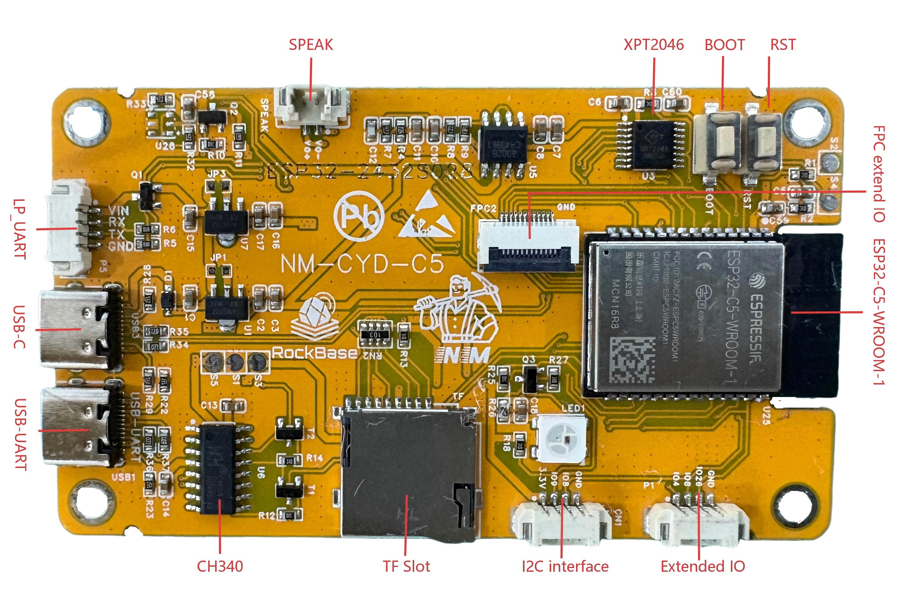
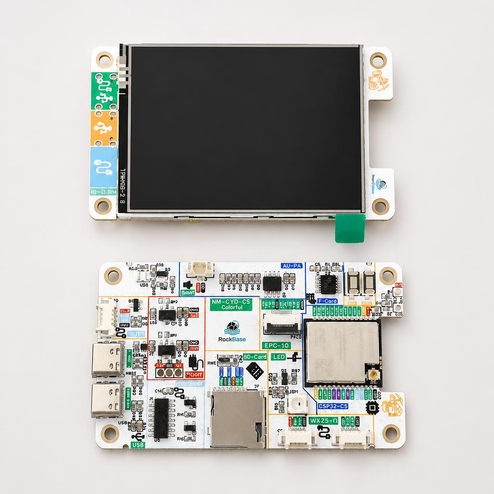
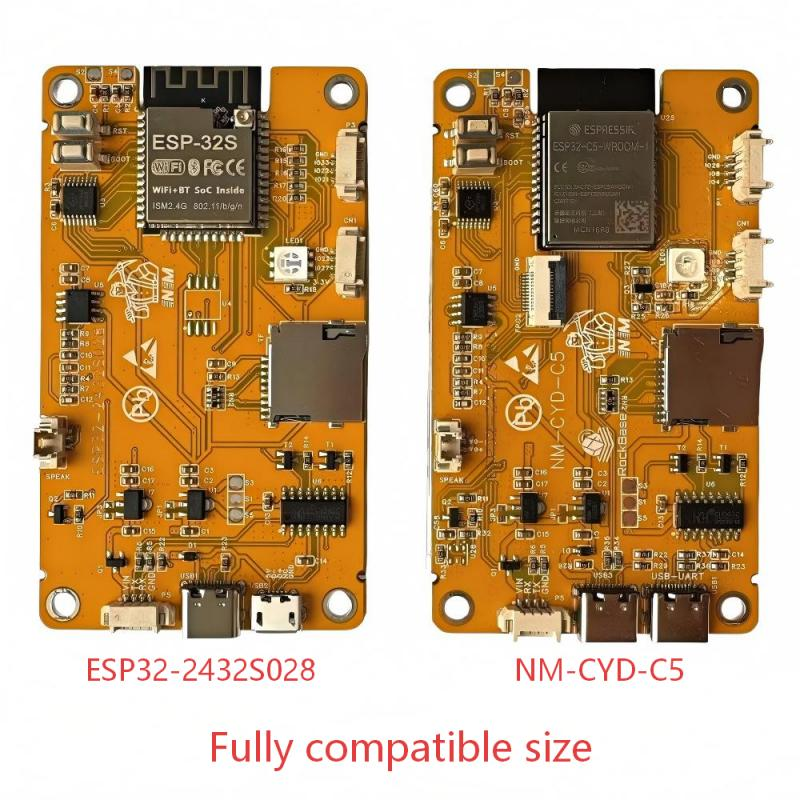
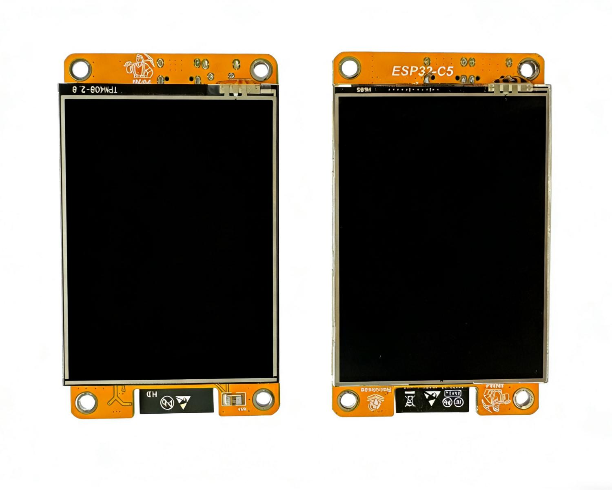

# NM-CYD-C5

[English](README.md) | 中文

NM-CYD-C5 是基于 ESP32-C5 的 CYD（Cheap Yellow Display），支持双频 Wi-Fi 6 / BLE 5 / Thread / Zigbee。

这款开发板搭载 ESP32-C5，内置 320 × 240 2.8 英寸 LCD 触摸屏，类似于 [ESP32-Cheap-Yellow-Display](https://github.com/witnessmenow/ESP32-Cheap-Yellow-Display)，默认 LCD 驱动为 ST7789，也可以更换为 ILI9341 驱动。

# 功能特性

NM-CYD-C5 具备以下特性：

- ESP32-C5-WROOM-1，16MB Flash 和 8MB PSRAM
- 320 × 240 LCD 显示屏（2.8 英寸）
- 电阻触摸屏
- ESP32-C5 USB Type-C 接口和 USB Type-C 转 UART 接口（CH340），用于供电和编程
- SD 卡槽、RGB LED 以及一些扩展引脚
- 尺寸和接口与 ESP32-Cheap-Yellow-Display 完全兼容，可直接替换
- 新增 FPC 连接器，方便连接外部模块

## ESP32-C5 的新特性

- ESP32-C5 RISC-V 32 位 @ 240 MHz
- 双频 Wi-Fi 6：2.4GHz 和 5GHz（802.11ax）
- 蓝牙 5：经典蓝牙和 BLE 5，支持 SPP、HID、GATT
- IEEE 802.15.4：支持 Zigbee 3.0 终端设备
- Thread：基于 IPv6 的网状网络协议

| 组件 | 规格 |
|:---:|:---:|
| **主控 SoC** | ESP32-C5（RISC-V 32 位，240MHz）|
| **无线协议** | Wi-Fi 6（802.11ax）2.4/5GHz + BLE 5.3 + IEEE 802.15.4 |
| **显示屏** | 2.8 英寸 TFT，240×320，ST7789，触摸屏 |
| **存储** | 16MB Flash + 8MB PSRAM |
| **接口** | 2× USB-C、GPIO、Micro SD 卡槽 |

# 购买渠道

您可以通过 RockBase IoT 速卖通店铺、RockBase IoT 官网或 NMTech 商店购买 NM-CYD-C5。

- [RockBase IoT Store](https://www.aliexpress.com/store/1105401362)
- [RockBase Shop](https://rockbase.shop/products/nm-cyd-c5)
- [NMTech Global Store](https://www.aliexpress.com/store/1104265822)
- [NMMiner](https://www.nmminer.com)

# NM-CYD-C5 入门指南

有关如何开始使用 NM-CYD-C5 的详细信息，请查看 [设置与配置](https://wiki.rockbaseiot.com/zh/docs/products/nm-cyd-c5/) 页面。

要使用 NM-CYD-C5，您需要使用最新版本的 espressif32 库，版本 3.3.5 或更高。

```ini
[env]
platform = https://github.com/pioarduino/platform-espressif32/releases/download/55.03.36/platform-espressif32.zip ; Arduino 3.3.6
```

使用 TFT_eSPI 驱动 LCD 时，您需要将 `TFT_eSPI_ESP32_C5.c/h` 添加到 Processors 目录，并在 `TFT_eSPI.c/h` 中更新 `CONFIG_IDF_TARGET_ESP32C5`。
相关文件可在 `Demos\Arduino\libraries\TFT_eSPI` 中找到。

## NM-CYD-C5 引脚定义

### 使用 ST7789 驱动显示屏，XPT2046 驱动触摸屏，共享 SPI 总线

| 设备 | SCK | MISO | MOSI | CS | IRQ |
| --- | :---: | :---: | :---: | :---: | :---: |
| 显示屏 | 6 | 2 | 7 | 23 | --- |
| 触摸屏 | 6 | 2 | 7 | 1 | --- |
| SD 卡 | 6 | 2 | 7 | 10 | --- |

### LP-UART（`NM-CYD-C5:P5`）用于 GPS 模块，例如 `NM-ATGM336H`，即插即用

| 设备 | RX | TX | GPIO |
| --- | :---: | :---: | :---: |
| GPS | 4 | 5 | --- |

### I2C 扩展 IO，`NM-CYD-C5: CN1`

| 1 | 2 | 3 | 4 |
|---|---|---|---|
| 3.3V | IO9 | IO8 | GND |

### 扩展 IO，`NM-CYD-C5: P1`

| 1 | 2 | 3 | 4 |
|---|---|---|---|
| IO4 | IO8 | IO26 | GND |

### NM 扩展 IO：12Pin FPC 接口，`NM-CYD-C5: FPC2`

| 1 | 2 | 3 | 4 | 5 | 6 | 7 | 8 | 9 | 10 | 11 | 12 |
|---|---|---|---|---|---|---|---|---|---|---|---|
| IO2 | IO6 | IO7 | IO10 | GND | IO4 | IO8 | IO5 | IO9 | USB D- | USB D+ | GND |

### WS2812 LEDC 和屏幕背光

| NM-CYD-C5 | 引脚 |
| :------: | :---: |
| IO25 | 显示屏背光 |
| IO27 | WS2812 RGB LED |




## NM-CYD-C5 彩色特别版

[RockBase IoT 彩色特别版](https://rockbase.shop/products/nm-cyd-c5-colorful) 即将发布，与普通版 NM-CYD-C5 兼容。


## NM-CYD-C5 外置天线板

应广大用户的需求，在最新批次的 NM-CYD-C5-Colorful 中，增加了外置天线版本的设计，用户可以根据需要选购。NM-CYD-C5-Colorful-Ant 都配置了一根 IPEX 1 连接线与一根 2.4G/5G 双频天线，方便用户进行外置天线的使用。外置天线版本的 NM-CYD-C5-Colorful 在 Wi-Fi 和 BLE 的信号接收上有更好的表现，适合对无线性能有更高要求的用户。



### 外置天线参数

- 天线频率范围：2400~2500MHz / 5000~5800MHz
- 驻波比（VSWR）：2400-2500 ≤ 2.5，5000-5800 ≤ 2.5
- 效率（Efficiency）：2400-2500: 83.3 AVG；5000-5800: 73.8 AVG
- 峰值增益 Peak Gain（dBi）：2400-2500: 3.2 AVG；5000-5800: 3.7 AVG
- 辐射方向：全向
- 极化方式：线极化

## 与 ESP32-2432S028 对比

| 特性 | 标准 CYD（ESP32）| NM-CYD-C5 |
| :---: | :---: | :---: |
| **Wi-Fi 频段** | 2.4GHz | 2.4+5GHz |
| **Wi-Fi 标准** | 802.11 b/g/n | 802.11ax（Wi-Fi 6）|
| **ZigBee** | 无 | ZigBee 3.0 |
| **Thread** | 无 | Thread 1.3 |
| **Flash** | 4MB | 16MB |
| **PSRAM** | 无 | 8MB |





# 支持的项目

## 已支持的项目

- [NMMiner](https://github.com/NMminer1024/NMMiner)
- [Brucefw](https://github.com/BruceDevices/firmware)
- [ESP32Marauder](https://github.com/RockBase-iot/ESP32Marauder)
- [Rogue-Radar](https://github.com/RockBase-iot/Rogue-Radar-CYD)

    Rogue Radar 是一款手持 ESP32 固件，将多种无线和实用工具集成到一个旋钮驱动的界面中。

- [CYM (Cheap Yellow Monster)](https://github.com/JimGat/CYM-NM28C5)

    Cheap Yellow Monster 是一款基于 NM-CYD-C5 运行的便携式触摸屏 WiFi 安全工具包。

- [Launcher](https://github.com/RockBase-iot/Launcher)

    适用于 M5Stack、Lilygo、CYD、Marauder 和 ESP32 设备的应用程序启动器。

- [ESP-Claw](https://github.com/espressif/esp-claw)

    ESP-Claw 是 Espressif 面向物联网设备的聊天式编程 AI 代理框架。它通过对话定义设备行为，并在 Espressif 芯片本地完成感知、决策和执行的完整闭环。受 OpenClaw 概念启发，使用 C 语言重新实现，ESP-Claw 轻量、智能且持续进化。

    

    *新版本发布*：ESP-Claw 0.3.0 已更新支持 NM-CYD-C5，合并了 `espressif/master` 的新功能。

如果您只想刷入固件，可以尝试 [RockBase IoT Web Flasher](https://flash.rockbaseiot.com)，选择设备类型 nm-cyd-c5。

如果您期望将您开发的固件或项目在 NM-CYD-C5 上运行，请联系 RockBase IoT 团队，我们将协助您进行适配和测试。

对于您产出的固件，希望在我们的 Web Flasher 上提供下载，可以关注项目 [ESPWebApps](https://github.com/RockBase-iot/ESPWebApps)，该项目是一个基于 ESP32 的 Web 应用程序管理平台，允许用户在 ESP32 上运行和管理多个 Web 应用程序。通过 ESPWebApps，您可以轻松地将项目与 NM-CYD-C5 的用户进行共享，可以轻松地下载、安装和更新应用程序，并在 NM-CYD-C5 上运行。

## 进行中的项目

- [HaleHound-CYD](https://github.com/JesseCHale/HaleHound-CYD)
- [ESP32-KillerBee](https://github.com/RockBase-iot/ESP32-KillerBee)
- [ESP32DualBandWardriver](https://github.com/justcallmekoko/ESP32DualBandWardriver)
